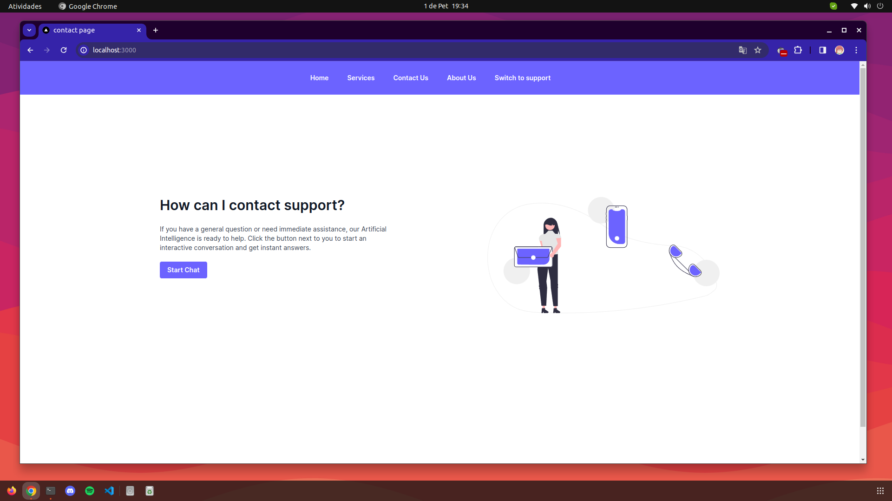

## Test for mongSO inc vacancy using socket io and artificial intelligence chatGPT 3.5



## Demo video

It is important to watch the demotation video

Open [https://www.youtube.com/watch?v=XjptKZzx6-8](https://www.youtube.com/watch?v=XjptKZzx6-8)

## Getting Started

First, run the development server:

```bash
npm run dev
# or
yarn dev
# or
pnpm dev
# or
bun dev
```

This project uses the chatGPT API through the Eden AI platform, create your account and get $5 in credit to redeem your usage key:

After creating your account and redeeming your key, place it in the .env.local_example file and remember to remove the word example from the file

Open [https://app.edenai.run/bricks/default](https://app.edenai.run/bricks/default)

Open [http://localhost:3000](http://localhost:3000) with your browser to see the result.
